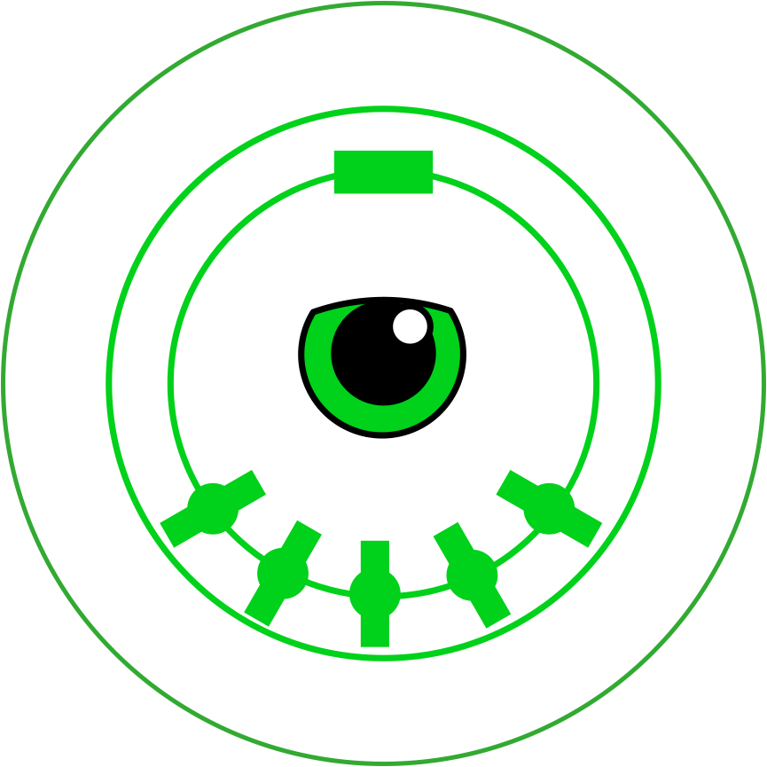

# The "Eye of AgaMIDI"

This package provides a MIDI router that uses a MIDI control input to alter the timing of a second connected device.

When time is moving forward, MIDI clock messages are sent periodically.

When time is moving backward, MIDI song pointer messages are used to back up the position by two steps, and then a clock
message is sent to allow the note to be played.  In this manner, a sequencer or other device can be instructed to play
in reverse.